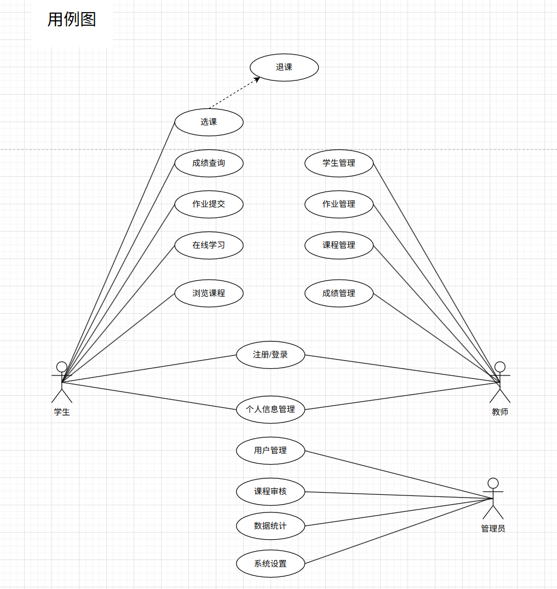
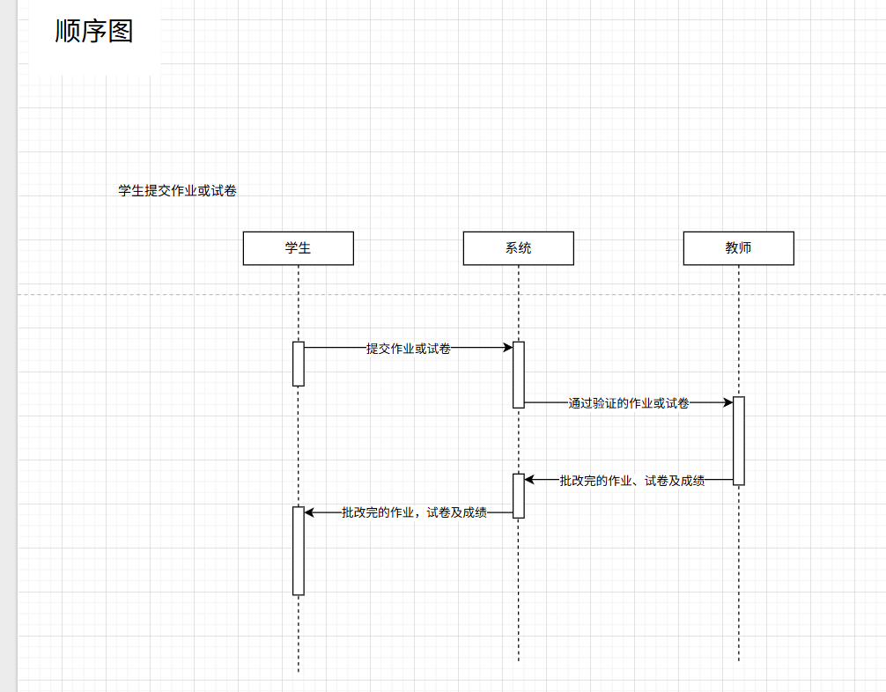
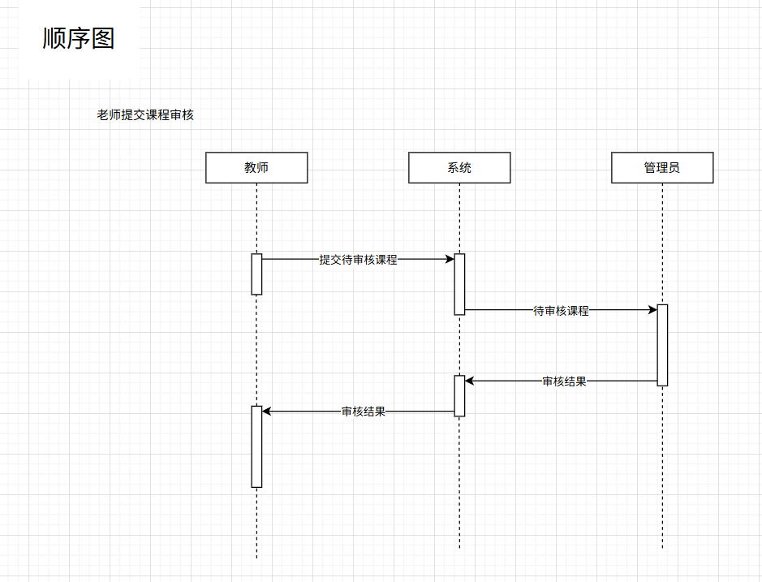
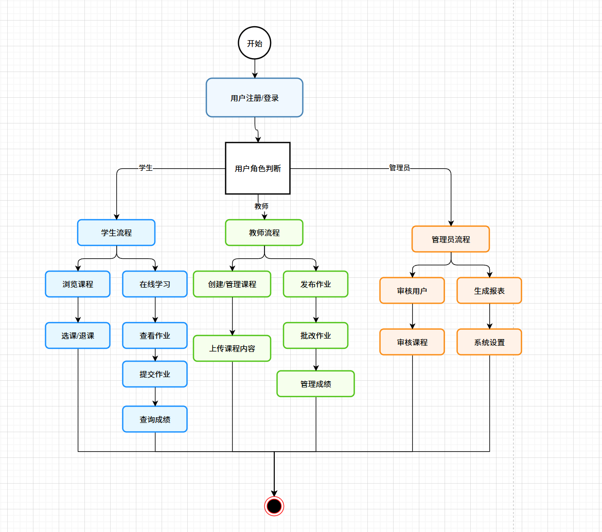
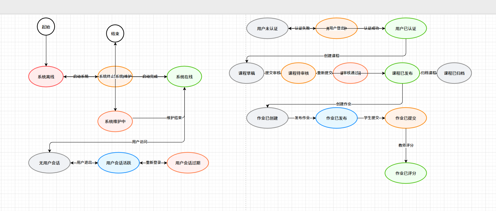

# 智慧学习平台需求文档

## 1. 引言

### 1.1 项目概述

智慧学习平台是一款面向高校“在线+混合式”教学场景的学习管理与教学协作平台，覆盖“选课—学习—作业—批改—成绩—分析—改进”的完整教学闭环。平台通过前后端分离与标准化接口将课程资源、学习过程数据与评价结果贯通，支持跨终端连续学习与状态同步；同时提供基于角色的权限与审计机制，保障数据安全与合规。借助可视化看板与报表能力，平台将教学活动沉淀为可度量、可优化的指标，帮助学校实现从经验驱动到数据驱动的转变。

平台具备以下核心价值：
- 学生：依据学习目标与兴趣，获得清晰的学习路径与反馈闭环，提升完成率与自我管理能力。
  - 待办驱动：聚合未完成作业、未学章节与临近截止事项，给出优先级与提醒。
  - 过程沉淀：自动记录视频进度、资料阅读与时间轴笔记，跨设备无缝续学。
  - 结果可见：成绩构成、趋势与分布一目了然，支持申诉与成绩单导出。
- 教师：以更低成本完成教学组织、在线批改与数据洞察，缩短反馈周期，提升教学质量。
  - 内容生产：批量上传与转码、多资源管理与可见性控制，轻松迭代课程内容。
  - 批改提效：在线批注、评分标尺与批量评分，异常项复核与自动统计分布。
  - 教学洞察：进度滞后、易错题与作业难度系数识别，支持分组与定向提醒。
- 学校管理员：实现统一治理、规范审批与安全合规，以数据看板支撑运营与决策。
  - 治理审批：用户与课程全生命周期管理，公告与高风险操作的分级审批。
  - 指标报表：用户规模、课程质量、访问性能与完成率等指标可视化与导出。
  - 风控审计：关键操作留痕、权限最小化与长期归档，满足校内审计与合规要求。

### 1.2 项目背景

高校教学数字化进入深化阶段，但“数据孤岛—重复劳动—治理失衡—体验不足”的结构性矛盾依然突出：
- 信息割裂与数据孤岛：选课、内容、作业、成绩散落多系统，口径不一致，形成“断点数据”。影响：无法建立统一学习画像与课程质量评估链，难以支撑基于证据的改进。
- 重复劳动与长反馈：作业收发、批改、登记、导出链路冗长，教师投入大量机械时间。影响：反馈周期拉长，学生难以及时纠偏，课堂外有效学习时间占比偏低。
- 治理盲区与高成本：管理端缺少可行动看板、阈值告警与审计追踪。影响：问题发现滞后，合规与安全压力增大，跨院系治理协同成本上升。
- 学习体验割裂：学生的任务不聚合、优先级不明确、进度不可视。影响：学习动机与完成率承压，新生适应期过长，留存与通过率受影响。

为此，平台以“学生为中心、数据为驱动、教学提效为目标”为原则，打造“待办—学习—提交—批改—分析—改进”的闭环。对应目标（建议作为阶段性KPI）：
- 教学效率：作业周转周期缩短≥30%，教师重复性操作时间下降≥40%。
- 学习成效：课程完成率提升≥10%，新生首学期留存提升≥15%。
- 治理能力：关键指标（访问性能、提交成功率、异常占比）可视化，重要事件T+1出具周/月报表。

### 1.3 平台定位

- 学习者中心：以“待办与进度”为核心的学习工作台，聚合作业、章节与公告，提供优先级与提醒，降低信息检索成本。
- 教学提效：以“批改与反馈”为核心的教师工作台，支持模板化作业、在线批注、评分标尺与批量评分，显著缩短反馈周期。
- 数据驱动：以指标与报表为核心的管理工作台，提供标准化口径、阈值告警与审计追踪，支撑合规、安全与资源优化配置。

### 1.4 目标用户群体

- 学生：需要一站式学习门户，明确“现在该做什么—做完之后能看到什么结果—下一步做什么”。
- 教师：需要低成本发布内容与作业，高效率批改与导出，以数据洞察驱动教学策略调整。
- 学校管理员：需要统一治理用户与课程、审批公告与高风险操作，获取跨院系、跨学期的对比性指标与合规审计能力。

### 1.5 需求分析

- 新生初入学：对课程结构、考核方式与资源分散缺乏认知。需求：聚合入口与路径指引、任务优先级提示、学习进度可视，缩短适应期。
- 教师多班授课：跨班发布与批改压力大。需求：批量操作、快捷批注、评分标尺、异常聚类识别与一键提醒，缩短作业周转与登记时间。
- 管理员统管多学院：治理对象广、信息口径多。需求：标准化报表、阈值告警、审计追踪、权限最小化与长期归档，降低治理与合规成本。

## 2. 功能需求和UML图描述

### 2.1 功能需求

#### 2.1.1 学生端功能界面要求

1. **平台主入口页面**：用户可以根据自身的实际需求，选择不同的登录入口，从而进入相应端的登录页面。具体来说，用户可以通过点击"学生登录"按钮，跳转至学生用户登录入口页面；点击"教师登录"按钮，跳转至教师登录入口页面；点击"管理员登录"按钮，跳转至学校管理员登录入口页面，以便不同角色的用户能够便捷地进入系统。

2. **学生登录/注册页面**：该页面专门为学生用户提供登录入口，学生可以通过输入学号作为账号，结合密码完成学生端的登录操作。此外，该页面还提供了账号注册按钮，方便新用户进行注册，同时也设有返回主页面按钮，方便用户在需要时返回主入口页面。系统支持统一身份认证（SSO），允许学生使用学校统一账号登录。

3. **学生端仪表盘页面**：该页面是学生用户的主要操作界面，主要显示学生已选课程的数量、待完成的作业数量、未学习的章节数量、未读公告数量、近期作业截止时间以及学习进度概览。同时，页面还提供了课程广场、我的课程、作业中心、成绩查询、消息中心等快捷入口，方便学生快速进行相关操作。顶部导航栏设有"我的主页（仪表盘）""课程广场""我的课程""作业中心""成绩查询""消息中心""个人中心"及"退出登录"按钮，以便学生进行页面切换和功能操作。

4. **课程广场与详情页面**：该页面展示全校所有可选课程的名片信息，支持学生通过搜索功能查找对应课程。学生可以依据专业、学期、课程类型以及课程难度进行筛选或搜索，快速找到感兴趣的课程。系统会自动检查选课名额是否已满、是否与其他已选课程时间冲突，并给出明确提示。点击课程卡片可直接查看课程详情（包括课程介绍、授课教师信息、课程大纲、学习资源列表以及最近课程公告）并进行选课操作。

5. **智能课程学习页面**：该页面展示课程章节列表、视频播放器、课件预览区、学习笔记区以及讨论区。学生可以在线播放课程视频（支持倍速、清晰度切换、章节跳转、断点续播），在线预览PDF/课件并可下载，在学习过程中记录带时间戳的笔记。学习进度与笔记会自动在不同设备间同步。**AI功能增强**：提供AI学习助手，支持智能答疑、知识点总结、个性化学习路径推荐、智能笔记整理与复习提醒等功能。

6. **作业与测验中心页面**：该页面整合了作业和测验功能，显示学生所有已选课程的作业和测验列表，支持按课程、状态（待提交/已提交/已批改/待参与/已参与）筛选。页面显示作业/测验标题、所属课程、截止时间、提交状态等信息。点击进入可查看详情并进行提交或参与。支持文件上传、文本输入和链接提交，允许在截止前重复提交（以最后一次为准）。测验支持单选、多选、填空、简答等多种题型。

7. **成绩查询与申诉页面**：该页面展示学生的课程成绩构成（平时分/作业/考试）、成绩趋势图与分布图，支持按课程、学期筛选。学生可以查看每门课程的详细成绩，包括各项作业和测验的得分情况。页面提供成绩单导出功能（Excel/PDF格式），并集成成绩申诉功能，学生可直接在此页面发起申诉，填写申诉理由、上传相关证据，并跟踪申诉处理进度和结果。

8. **消息与通知中心页面**：该页面集中显示所有课程公告、作业提醒、成绩发布通知与系统通知，支持按课程、类型（公告/提醒/通知）筛选。重要提醒可选择同步到邮件/短信。学生可以标记消息为已读或未读，删除不需要的消息。

9. **个人中心页面**：该页面支持学生编辑个人信息（头像、联系方式、专业、年级等）、修改密码、查看历史登录设备、管理隐私设置和提醒偏好。学生可以查看自己的学习统计数据，包括总学习时长、完成作业数、获得积分等。

#### 2.1.2 教师端功能界面要求

10. **教师登录页面**：该页面为教师用户提供登录入口，教师通过输入工号作为账号，结合密码进行教师端的登录。页面提供返回主页面按钮，但不提供账号注册按钮，以确保系统的安全性和管理权限的严格控制。系统支持统一身份认证（SSO）。

11. **教师端仪表盘页面**：该页面显示教师当前授课课程数量、待批改作业数量、待审批活动申请数量、课程总学生数、近期课程公告等核心数据。页面提供创建课程、发布作业、批改作业、查看统计等快捷入口，方便教师快速进行相关操作。顶部导航栏设有"我的主页（仪表盘）""课程管理""作业管理""学生管理""统计分析""个人中心"及"退出登录"按钮。

12. **课程与资源管理页面**：该功能模块整合了课程管理和资源管理功能，允许教师创建新课程、编辑已有课程信息、配置学期、授课班级、助教、开课时间等基本信息，支持从以往课程一键复用大纲与资源。同时支持批量上传视频/课件等学习资源，系统会自动转码与生成预览。教师可以设置资源的可见范围以及发布时间，管理资源的分类和标签，对资源进行编辑、删除等操作。

13. **作业与测验管理页面**：该功能模块整合了作业管理和测验管理功能，允许教师基于模板快速创建作业和测验，设置作业/测验要求、评分标准、截止时间等信息。教师可以配置防抄袭提示、允许重提交次数、迟交扣分规则等选项。同时提供作业收集与监控功能，实时查看作业提交率、逾期率、格式异常与可疑重复等情况，并支持在线批注作业，按评分标尺打分，使用模板评语快速反馈。

14. **学生管理与成绩页面**：该功能模块整合了学生管理和成绩管理功能，允许教师查看每个班级/小组的学生列表、学习进度与作业完成度，对"明显落后"的学生一键发送提醒。教师可以查看和编辑学生成绩，按时间或条件批量发布成绩，导出成绩与评语汇总。可以查看成绩分布、平均分等统计信息。

15. **教师个人中心页面**：该页面支持教师编辑个人信息（头像、联系方式等）、修改密码、查看历史登录设备、管理隐私设置和提醒偏好。

#### 2.1.3 管理员端功能界面要求

16. **管理员登录页面**：该页面为学校管理员提供登录入口，学校管理员通过输入管理员账号作为账号，结合密码进行管理员端的登录。页面提供返回主页面按钮，但不提供账号注册按钮，以确保系统的安全性和管理权限的严格控制。

17. **管理员端仪表盘页面**：该页面显示平台当前的用户总数、课程总数、活跃用户数、待审批事项数量、系统访问性能指标等核心数据。页面提供用户管理、课程管理、审批管理、数据统计等快捷入口，方便管理员快速进行相关操作。顶部导航栏设有"我的主页（仪表盘）""用户管理""课程管理""审批管理""数据统计""系统设置""审计日志"及"退出登录"按钮。

18. **用户与组织管理页面**：该功能模块整合了用户管理和组织管理功能，允许学校管理员对用户进行管理，包括新增/停用用户、重置密码、分配角色（学生/教师/管理员）、批量导入导出用户信息并自动校验模板格式。同时支持管理院系、班级等组织信息，同步院系与班级信息，支持批量导入导出组织数据。管理员可以按学院、年级、角色筛选用户，查看用户详细信息，管理用户权限。

### 2.2 UML图

#### 2.2.1 用例图

#### 2.2.2 用例描述

**a. 学生用户用例描述**

**1. 选择登录入口**

- **参与者**：学生、教师、学校管理员
- **描述**：用户根据角色选择相应的登录入口
- **前置条件**：用户访问平台主入口页面
- **后置条件**：进入对应角色的登录页面
- **基本流程**：
  1. 系统显示主入口页面
  2. 用户点击相应角色登录按钮（学生登录/教师登录/管理员登录）
  3. 系统跳转到对应登录页面

**2. 学生注册与登录**

- **参与者**：学生
- **描述**：学生用户注册或登录系统
- **前置条件**：学生访问学生登录/注册页面
- **后置条件**：注册成功或登录进入学生端仪表盘
- **基本流程**：
  1. 学生访问学生登录/注册页面
  2. 如需注册，点击注册按钮并填写注册信息（学号、姓名、密码、邮箱、专业、年级等）
  3. 系统验证信息合法性（学号唯一性、密码强度等）
  4. 系统创建账号并提示注册成功
  5. 学生输入学号和密码进行登录
  6. 系统验证凭据（支持统一认证SSO）
  7. 登录成功，进入学生端仪表盘

**3. 浏览仪表盘**

- **参与者**：学生
- **描述**：查看个人数据和快捷入口
- **前置条件**：学生已登录
- **后置条件**：显示个人概览信息
- **基本流程**：
  1. 系统显示已选课程数量
  2. 显示待完成作业数量
  3. 显示未学习章节数量
  4. 显示未读公告数量
  5. 显示近期作业截止时间
  6. 显示学习进度概览
  7. 提供课程广场、我的课程、作业中心等快捷入口

**5. 选课**

- **参与者**：学生
- **描述**：学生选择课程
- **前置条件**：学生已登录，处于选课期间
- **后置条件**：课程添加到学生课程列表
- **基本流程**：
  1. 学生进入课程广场页面
  2. 学生按专业、学期、关键词搜索课程
  3. 系统返回符合条件的课程列表
  4. 学生点击课程查看详情
  5. 学生点击选课按钮
  6. 系统检查名额是否已满
  7. 系统检查时间是否冲突
  8. 系统显示选课确认页面
  9. 学生确认选课
  10. 系统记录选课信息并更新课表

**6. 学习课程内容**

- **参与者**：学生
- **描述**：学生在线学习课程视频和资料
- **前置条件**：学生已登录，已选该课程
- **后置条件**：更新学习进度和笔记
- **基本流程**：
  1. 学生进入课程学习页面
  2. 学生选择要学习的章节
  3. 系统加载视频或资料
  4. 学生播放视频（支持倍速、清晰度切换）
  5. 学生记录学习笔记（带时间戳）
  6. 系统自动保存播放进度
  7. 系统自动保存笔记内容
  8. 学习进度和笔记在不同设备间同步

**7. 提交作业**

- **参与者**：学生
- **描述**：学生提交作业
- **前置条件**：学生已登录，作业未截止
- **后置条件**：作业提交成功，生成回执编号
- **基本流程**：
  1. 学生进入作业详情页面
  2. 学生查看作业要求、截止时间、评分标准
  3. 学生上传作业文件或输入文本内容
  4. 系统检查文件格式和大小
  5. 系统进行病毒扫描
  6. 学生确认提交
  7. 系统保存提交记录
  8. 系统生成提交回执编号
  9. 系统更新作业状态为"已提交"

**8. 查看成绩**

- **参与者**：学生
- **描述**：学生查看课程成绩
- **前置条件**：学生已登录，成绩已发布
- **后置条件**：显示成绩信息
- **基本流程**：
  1. 学生进入成绩查询页面
  2. 学生选择要查看的课程
  3. 系统显示成绩构成（平时分/作业/考试）
  4. 系统显示成绩趋势图和分布图
  5. 学生可以查看详细成绩明细
  6. 学生可以导出成绩单（PDF/Excel）

**9. 修改个人数据**

- **参与者**：学生
- **描述**：学生修改个人信息
- **前置条件**：学生已登录
- **后置条件**：显示修改成功，个人信息同步更新
- **基本流程**：
  1. 学生进入个人信息页面
  2. 学生点击修改个人信息
  3. 系统显示可修改的个人信息
  4. 学生选择想修改的信息并进行修改
  5. 系统提示修改成功
  6. 系统更新个人信息

**b. 教师用户用例描述**

**1. 教师登录**

- **参与者**：教师
- **描述**：教师用户登录系统
- **前置条件**：教师有有效账号
- **后置条件**：进入教师端仪表盘
- **基本流程**：
  1. 教师输入工号和密码
  2. 系统验证凭据（支持统一认证SSO）
  3. 登录成功，进入教师端仪表盘

**2. 创建课程**

- **参与者**：教师
- **描述**：教师创建新课程
- **前置条件**：教师已登录
- **后置条件**：创建新课程记录
- **基本流程**：
  1. 教师进入课程管理页面
  2. 教师点击创建课程按钮
  3. 教师填写课程基本信息（课程名称、学期、授课班级、助教等）
  4. 教师设置课程可见范围和开课时间
  5. 教师可以选择从以往课程复用大纲和资源
  6. 教师保存课程信息
  7. 系统创建课程并生成课程主页

**3. 发布作业**

- **参与者**：教师
- **描述**：教师发布作业给学生
- **前置条件**：教师已登录，已创建课程
- **后置条件**：作业发布成功，学生收到提醒
- **基本流程**：
  1. 教师进入作业管理页面
  2. 教师点击创建作业按钮
  3. 教师基于模板填写作业要求
  4. 教师设置评分标准和截止时间
  5. 教师配置作业选项（防抄袭提示、允许重提交次数、迟交扣分等）
  6. 教师选择作业适用的班级
  7. 教师发布作业
  8. 系统生成作业链接
  9. 系统自动提醒选课学生
  10. 系统在学生端生成待办事项

**4. 批改作业**

- **参与者**：教师
- **描述**：教师批改学生提交的作业
- **前置条件**：教师已登录，学生已提交作业
- **后置条件**：作业评分完成，学生可查看成绩
- **基本流程**：
  1. 教师进入作业批改页面
  2. 教师查看学生提交的作业内容
  3. 教师在网页上直接批注作业
  4. 教师按评分标尺打分
  5. 教师使用模板评语或自定义评语
  6. 教师保存评分和评语
  7. 系统记录批改操作（谁在什么时候改了什么）
  8. 系统更新作业状态为"已批改"
  9. 系统通知学生查看批改结果

**5. 查看学习分析**

- **参与者**：教师
- **描述**：教师查看学生学习数据分析
- **前置条件**：教师已登录，有授课课程
- **后置条件**：显示学习分析结果
- **基本流程**：
  1. 教师进入学习分析页面
  2. 教师选择要分析的课程
  3. 系统生成章节到课率统计
  4. 系统生成进度滞后学生名单
  5. 系统生成题目易错点分析
  6. 系统生成作业难度系数统计
  7. 系统显示可视化图表
  8. 教师可以一键向滞后学生发送提醒

**6. 修改个人数据**

- **参与者**：教师
- **描述**：教师修改个人信息
- **前置条件**：教师已登录
- **后置条件**：显示修改成功，个人信息同步更新
- **基本流程**：
  1. 教师进入个人信息页面
  2. 教师点击修改个人信息
  3. 系统显示可修改的个人信息
  4. 教师选择想修改的信息并进行修改
  5. 系统提示修改成功
  6. 系统更新个人信息

**c. 管理员用户用例描述**

**1. 管理员登录**

- **参与者**：学校管理员
- **描述**：学校管理员登录系统
- **前置条件**：管理员有有效账号
- **后置条件**：进入管理员端仪表盘
- **基本流程**：
  1. 管理员输入账号和密码
  2. 系统验证凭据
  3. 登录成功，进入管理员端仪表盘

**2. 用户管理**

- **参与者**：学校管理员
- **描述**：管理员管理用户信息
- **前置条件**：管理员已登录
- **后置条件**：用户信息更新完成
- **基本流程**：
  1. 管理员进入用户管理页面
  2. 管理员可以新增用户、停用用户、重置密码
  3. 管理员可以批量导入用户信息
  4. 系统自动校验模板格式
  5. 系统显示导入结果（成功/失败数量）
  6. 管理员可以分配用户角色和权限
  7. 系统更新用户信息并记录操作日志

**3. 课程审批**

- **参与者**：学校管理员
- **描述**：管理员审批课程相关内容
- **前置条件**：管理员已登录，有待审批事项
- **后置条件**：审批完成，记录审批结果
- **基本流程**：
  1. 管理员进入审批管理页面
  2. 管理员查看待审批事项列表
  3. 管理员点击查看审批详情
  4. 管理员查看相关内容（课程信息、活动信息等）
  5. 管理员选择通过或驳回
  6. 管理员填写审批意见（如需要）
  7. 系统记录审批结果
  8. 系统通知相关教师审批结果

**4. 数据统计**

- **参与者**：学校管理员
- **描述**：管理员查看平台数据统计
- **前置条件**：管理员已登录
- **后置条件**：显示统计数据
- **基本流程**：
  1. 管理员进入数据统计页面
  2. 管理员选择统计维度（时间范围、学院、课程等）
  3. 系统生成用户规模统计
  4. 系统生成课程数量统计
  5. 系统生成提交成功率统计
  6. 系统生成访问性能指标
  7. 系统显示可视化图表
  8. 管理员可以导出统计报表

#### 2.2.3 顺序图及描述

顺序图描述了系统各角色之间以及系统各组件之间的交互时序。

**典型场景1：学生提交作业-教师批改**

该顺序图详细呈现了从学生提交作业到教师完成批改的交互时序：

1. 学生发起 “提交作业或试卷” 请求；
2. 系统接收请求后，依次完成文件存储（对象存储服务）、格式检查、病毒扫描，随后保存提交记录、生成回执编号，并发送批改通知给教师；
3. 教师接收通知后，进入批改环节，完成作业查看、批注评分操作；
4. 系统保存教师的批改结果，并发送结果通知给学生；
5. 学生最终接收并查看批改完成的作业、试卷及成绩。

**典型场景2：教师提交课程审核—管理员审核**

该顺序图清晰呈现了从教师提交课程审核到审核结果反馈的交互时序：

1. 教师发起 “提交待审核课程” 请求；
2. 系统接收请求后，将 “待审核课程” 流转至管理员；
3. 管理员完成审核操作后，将 “审核结果” 返回给系统；
4. 系统最终将 “审核结果” 反馈给教师。

#### 2.2.4 数据流图以及描述

**0层数据流图**：展示了 “智慧学习平台” 系统的顶层数据流，明确了三类外部实体（学生、教师、管理员）与系统之间的数据流交互。其中，学生向系统输入用户注册信息、登录凭证、选课请求、作业提交内容、成绩查询条件等，并从系统获取登录结果、课程列表、作业反馈、成绩信息；教师向系统输入教师注册信息、登录凭证、课程创建信息、作业发布内容、作业批改结果、成绩录入信息等，从系统获取登录结果、课程信息、作业提交列表；管理员向系统输入用户审核指令、课程审核指令、统计请求参数、系统配置信息等，从系统获取审核结果、统计报表、配置结果反馈。通过这些数据流，呈现了系统在顶层的业务输入输出与外部实体的交互全貌。

**1层数据流图**：将 “智慧学习平台” 系统分解为用户管理模块、课程管理模块、作业管理模块、成绩管理模块、系统管理模块五大核心功能模块，并明确了数据存储（D1 用户数据存储、D2 课程数据存储、D3 作业数据存储、D4 成绩数据存储）与各模块、外部实体（学生、教师、管理员）之间的数据流交互。
  - 用户管理模块：处理学生的用户注册信息、登录凭证，教师的教师注册信息、登录凭证，以及管理员的用户审核指令，输出登录结果、选课结果、审核结果，数据交互关联 D1 用户数据存储；
  - 课程管理模块：承接教师的课程创建信息、课程更新信息，管理员的课程审核指令，输出课程操作结果、课程审核结果，数据交互关联 D2 课程数据存储；
  - 作业管理模块：处理教师的作业发布内容、作业批改结果，学生的作业提交内容，输出作业发布结果、提交结果，数据交互关联 D3 作业数据存储；
  - 成绩管理模块：处理教师的成绩录入信息，学生的成绩查询条件，输出成绩录入结果、成绩信息，数据交互关联 D4 成绩数据存储；
  - 系统管理模块：处理管理员的系统配置信息、统计请求参数，输出配置结果、统计报表，同时整合成绩统计数据、课程统计数据、用户统计数据，与各模块及数据存储进行交互。
通过这些模块的拆解与数据流梳理，呈现了系统内部核心功能的协作逻辑与数据流转细节。

**2层数据流图**：对 1 层的五大核心模块进行进一步拆解，细化各模块内部的子流程与数据流交互：
  
  - 用户管理模块：分解为 1.1 用户注册、1.2 用户登录、1.3 用户审核三个子模块。学生输入用户注册信息，教师输入教师注册信息，经 1.1 用户注册后将新用户数据、新教师数据存入用户数据存储；学生和教师输入登录凭证，1.2 用户登录调用用户数据存储中的用户认证数据、教师认证数据返回登录结果；管理员输入用户审核指令，1.3 用户审核基于用户数据存储的用户审核状态输出审核结果。
  
  - 课程管理模块：分解为 2.1 课程创建、2.2 课程资源管理、2.3 选课管理三个子模块。教师输入课程创建信息，2.1 课程创建结合管理员的课程审核指令与课程数据存储的课程审核状态，输出课程创建结果并将新课程数据存入课程数据存储；教师输入资源添加信息、资源删除指令，2.2 课程资源管理调用课程数据存储的课程资源数据输出资源操作结果；学生输入选课请求、退课请求，2.3 选课管理调用课程数据存储的选课数据输出选课结果。
  
  - 作业管理模块：分解为 3.1 作业发布、3.2 作业提交、3.3 作业批改三个子模块。教师输入作业发布内容，3.1 作业发布调用作业数据存储的作业数据输出作业发布结果；学生输入作业提交内容，3.2 作业提交调用课程管理模块的课程 ID 和作业数据存储的提交数据输出提交结果；教师输入作业批改结果，3.3 作业批改调用作业数据存储的批改数据完成流程。
  
  - 成绩管理模块：分解为 4.1 成绩录入、4.2 成绩查询两个子模块。教师输入成绩录入信息，4.1 成绩录入调用作业管理模块的批改分数和成绩数据存储的成绩数据输出成绩录入结果；学生输入成绩查询条件，4.2 成绩查询调用成绩数据存储的成绩查询输出成绩信息。
  
  - 系统管理模块：分解为 5.1 统计报表生成、5.2 系统配置两个子模块。管理员输入统计请求参数，5.1 统计报表生成调用用户数据存储的用户统计数据、课程数据存储的课程统计数据、成绩数据存储的成绩统计数据输出统计报表；管理员输入系统配置信息，5.2 系统配置输出配置结果并维护系统参数。
通过这样的细分，清晰呈现了各模块内部的业务逻辑与数据流转的微观过程。

#### 2.2.5 对象图以及描述

**对象图**：展示了 “智慧学习平台” 在特定时刻的运行时对象实例及其关联关系，具体包含以下关键对象与交互：
- 用户相关对象：
	- 教师对象teacherLi（教师 ID “T001”，主讲 “Python 编程”），关联用户对象userTeacher（用户 ID “U001”，角色 “教师”）；
	- 学生对象studentZhang（学生 ID “S001”，专业 “计算机科学”），关联用户对象userStudent（用户 ID “U002”，角色 “学生”）。
- 课程相关对象：
	- 课程对象coursePython（课程 ID “C001”，名称 “Python 程序设计”），由teacherLi授课，包含资源对象resourceVideo（资源 ID “CR001”，类型 “video”），关联作业对象homeworkFunc（作业 ID “H001”，标题 “Python 函数作业”），且被studentZhang通过选课对象selectionCS001（选课 ID “CS001”，状态 “selected”）选中。
- 作业与成绩相关对象：
	- studentZhang提交作业提交对象submissionHS001（提交 ID “HS001”，提交文件路径 “/uploads/zhang_func.zip”），关联homeworkFunc；submissionHS001对应成绩对象scoreSC001（成绩 ID “SC001”，分数 85.5，反馈 “代码规范，边界条件需优化”）。
这些对象通过 “是（用户角色关联）”“授课”“发布”“包含”“关联”“被选”“提交”“拥有” 等关系，完整呈现了系统某一时刻的对象实例交互全景。

#### 2.2.6 类图以及描述

**类图**：清晰定义了 “智慧学习平台” 的领域模型，涵盖主要类的结构、属性、方法及类间关系：
**核心类结构**：
  - User（用户基类）：含userid（主键）、name、account、password、role等属性，提供register、login、updateInfo等方法，是Student（学生类）、Teacher（教师类）、Admin（管理员类）的父类。
  - Student（学生类）：扩展属性studentId、grade、major，提供selectCourse、dropCourse、submitHomework、viewScore等方法。
  - Teacher（教师类）：扩展属性teacherId、department、subject，提供createCourse、updateCourse、deleteCourse、publishHomework、gradeHomework、enterScore等方法。
  - Admin（管理员类）：扩展属性adminId、permission，提供auditUser、auditCourse、generateReport、setSystemConfig等方法，负责用户、课程的审核及系统配置。
  - Course（课程类）：含courseId（主键）、courseName、description、status、teacherId（外键关联 User）等属性，提供addResource、removeResource、getSelections等方法。
  - CourseResource（资源类）：含resourceId（主键）、courseId（外键关联 Course）、resourceType、resourceUrl、uploadTime等属性。
  - Homework（作业类）：含homeworkId（主键）、courseId（外键关联 Course）、title、requirement、deadline、status等属性，提供publish、closeSubmission、getSubmissions等方法。
  - HomeworkSubmission（提交类）：含submissionId（主键）、homeworkId（外键关联 Homework）、studentId（外键关联 User）、submitFileUrl、submitTime、score、feedback等属性。
  - Score（成绩类）：含scoreId（主键）、studentId（外键关联 User）、courseId（外键关联 Course）、homeworkId（作业成绩时非空）、scoreValue、scoreType、recordTime等属性。
  - CourseSelection（选课类）：含selectionId（主键）、courseId（外键关联 Course）、studentId（外键关联 User）、selectTime、status等属性。
**类间关系**：
  - 继承：Student、Teacher、Admin均继承自User；
  - 关联（授课）：Teacher与Course为1 对多关联，一名教师可授多门课；
  - 关联（选课）：Student与CourseSelection为1 对多，Course与CourseSelection为1 对多，一名学生可选多门课、一门课可被多名学生选；
  - 包含（课程 - 资源）：Course与CourseResource为1 对多，一门课可含多种资源；
  - 包含（课程 - 作业）：Course与Homework为1 对多，一门课可发布多个作业；
  - 被提交（作业 - 提交）：Homework与HomeworkSubmission为1 对多，一个作业可被多名学生提交；
  - 产生（成绩）：Score与Course、Student、Homework（可选）存在关联，记录学生课程或作业成绩；
  - 审核：Admin与User、Course存在审核关系，负责用户账号、课程的审核。

#### 2.2.7 活动图以及描述

**活动图**：呈现了 “智慧学习平台” 中不同角色的核心业务流程，以 “用户注册 / 登录” 为起点，通过 “用户角色判断” 决策点，分支为三类角色的活动流：
  - 学生流程：依次开展 “浏览课程→选课 / 退课”“在线学习→查看作业→提交作业→查询成绩” 等活动；
  - 教师流程：涵盖 “创建 / 管理课程→上传课程内容”“发布作业→批改作业→管理成绩” 等活动；
  - 管理员流程：包含 “审核用户→审核课程”“生成报表→系统设置” 等活动。
  所有流程最终汇聚至结束节点，完整展示了平台中用户角色驱动的业务活动全景与流转逻辑。
同时，针对细分场景的活动图可进一步补充细节：
  - 学生提交作业活动图：从 “学生进入作业页面” 开始，经 “查看作业要求→准备作业内容→上传作业文件”，通过 “系统检查文件格式（格式不合法则返回错误提示并重新上传）→系统病毒扫描（扫描未通过则返回错误提示）”，再经 “学生确认提交→系统保存提交记录→系统生成回执编号→系统发送通知给教师”，最终 “提交完成” 结束。
  - 教师批改作业活动图：以 “教师进入批改页面” 为起点，依次 “查看待批改作业列表→选择要批改的作业→查看学生提交内容→进行批注和评分→保存批改结果”，通过 “判断是否还有待批改作业（有则继续批改下一个，无则批量发布成绩）”，最后 “系统发送通知给学生”，完成 “批改完成”。

#### 2.2.8 状态图以及描述

**状态图**：展示了 “智慧学习平台” 中多类对象的状态变化及流转逻辑，包含以下核心状态流：
  - 系统状态流：从 “起始” 进入 “系统离线”，经 “启动系统” 到 “系统终止系统维护”，再通过 “启动完成” 进入 “系统在线”；若触发 “系统维护” 则进入 “系统维护中”，维护结束后回到 “系统在线”，最终流向 “结束”。
  - 用户会话状态流：“无用户会话” 经 “用户访问” 进入 “用户会话活跃”，会话 “过期” 后可 “重新登录” 回到活跃状态，“用户退出” 则返回无会话状态。
  - 用户认证状态流：“用户未认证” 经 “用户登录中”，认证成功进入 “用户已认证”，失败则回到未认证状态。
  - 课程状态流：“课程草稿” 经 “提交审核” 到 “课程待审核”，审核 “通过” 后进入 “课程已发布”，可 “归档课程” 至 “课程已归档”；若审核未通过则 “重新提交” 回到待审核状态。
  - 作业状态流：“作业已创建” 经 “发布作业” 进入 “作业已发布”，学生 “提交” 后到 “作业已提交”，教师 “评分” 后进入 “作业已评分”。
同时，细分场景的状态图可进一步完善：
  - 作业状态图：“作业已创建”→（发布作业）“作业已发布”→（学生提交）“作业已提交”→（教师评分）“作业已评分”；若作业有生命周期延伸，还可从 “作业已发布”→（到达截止时间）“作业已截止”→（教师批改）“作业批改中”→“作业已评分”→（课程归档）“作业已归档”。
  - 作业提交状态图：“草稿”→（学生提交）“已提交”；若支持撤回，“已提交”→（撤回操作）“撤回状态”→（重新提交）“重提状态”→“已提交”；“已提交”→（教师批改）“被批改状态”→（学生申诉）“申诉中状态”→（申诉处理）“已结案状态”。
这些状态图完整呈现了平台中系统、用户、课程、作业等对象的状态变化全景与业务驱动的流转规则。

## 3. 系统安全需求

### 3.1 用户身份认证与访问控制

平台需要建立完善的用户身份认证机制，确保只有合法用户才能访问系统。学生和教师可以使用学校的统一账号登录，系统会自动验证用户身份，避免用户需要重复注册多个账号。登录过程中，系统会要求用户输入密码，并支持验证码验证，防止自动化工具恶意尝试登录。

对于登录失败的情况，系统会记录失败次数，当连续失败超过一定次数时，系统会自动锁定该账号一段时间，防止他人通过反复尝试密码来破解账号。账号解锁可以通过管理员操作或等待锁定时间结束。

系统为不同角色分配不同的权限范围，学生只能访问自己的学习内容和作业，教师可以管理自己创建的课程和作业，管理员拥有更广泛的管理权限。系统遵循最小权限原则，即每个用户只被授予完成其工作所必需的最小权限，避免权限过度分配带来的安全风险。

### 3.2 数据传输安全

平台所有用户与服务器之间的通信都必须使用加密传输，防止数据在传输过程中被窃听或篡改。系统采用标准的HTTPS协议，确保所有敏感信息在网络上传输时都经过加密处理，即使是网络管理员也无法看到传输的具体内容。

对于系统内部服务之间的通信，同样采用加密机制，确保关键数据在系统内部流转时也受到保护。系统会定期更新加密证书，保持加密标准的时效性。

### 3.3 数据存储安全

平台存储的所有敏感信息都必须经过加密处理，特别是用户密码、个人身份信息等关键数据。密码在存储时会被转换为无法逆向还原的加密形式，即使数据库泄露，攻击者也无法直接获取用户的原始密码。

对于个人身份信息等敏感数据，系统在存储时也会进行加密处理，只有经过授权的系统功能才能访问这些数据的明文形式。系统日志中如果涉及敏感信息，会自动进行脱敏处理，既保证日志的完整性以便排查问题，又避免敏感信息泄露。

系统会定期备份重要数据，备份数据同样经过加密处理，并存储在安全的位置。备份数据可以用于在系统出现故障时恢复数据，确保教学活动的连续性。

### 3.4 系统安全防护

平台需要具备抵御常见网络攻击的能力。系统会对所有用户输入进行严格校验，防止恶意代码通过输入框注入系统。对于文件上传功能，系统会检查文件类型和大小，并对上传的文件进行病毒扫描，确保不会上传恶意文件。

系统会监控异常访问行为，例如某个用户短时间内发起大量请求，或者某个IP地址尝试访问大量不同账号，系统会自动识别并采取限制措施。对于高风险操作，如批量删除、成绩批量修改等，系统会要求管理员进行二次确认，并记录详细的操作日志。

系统会定期进行安全漏洞扫描和评估，及时发现和修复潜在的安全问题。对于发现的安全漏洞，系统会按照优先级进行修复，关键漏洞优先处理。

### 3.5 操作审计与日志

平台会记录所有关键操作的详细日志，包括谁在什么时候执行了什么操作，操作的结果如何。这些日志不可被普通用户修改或删除，只有系统管理员才能查看，确保操作的可追溯性。

对于涉及敏感数据的操作，如查看学生成绩、修改课程信息等，系统会额外记录操作原因和审批流程，形成完整的审计轨迹。这些日志会长期保存，满足学校对合规性和审计的要求。

系统会定期生成安全审计报告，汇总一段时间内的安全事件、异常访问、权限变更等信息，帮助管理员了解系统的安全状况，及时发现和处理潜在风险。

### 3.6 隐私保护

平台严格遵循隐私保护原则，只收集完成教学管理所必需的数据，不会收集无关的个人信息。在收集用户信息前，系统会明确告知用户收集的目的和用途，用户有权了解自己的数据如何被使用。

用户对自己的数据拥有访问、导出和删除的权利。学生可以查看系统存储的自己的所有信息，可以导出自己的学习记录和成绩单，在符合学校规定的前提下，可以申请删除某些个人数据。所有数据访问、导出和删除操作都会记录在日志中，确保操作的可追溯性。

系统不会将用户数据用于教学管理以外的目的，不会未经用户同意向第三方共享数据。如果确实需要共享数据，系统会先获得用户授权，并明确告知共享的范围和用途。

## 4. 非功能性需求

非功能性需求描述了系统在性能、可靠性、可维护性、易用性等方面的要求，这些要求虽然不直接体现为功能，但对系统的整体质量和用户体验至关重要。

### 4.1 系统性能要求

平台需要在正常的校园网络环境下，确保用户打开首页或课程页面时，页面能够快速加载完成，首屏内容显示时间不超过2秒。对于用户常用的功能，如课程搜索、作业提交、成绩查询等，系统响应时间应该足够快，即使在大量用户同时使用的高峰期，绝大部分请求也应该在合理时间内完成响应。

在容量规划方面，系统首期需要能够稳定支持至少500名用户同时在线使用，随着用户规模的增长，系统应该能够通过增加服务器资源的方式平滑扩展，最终支持上万名用户同时使用。系统设计时需要考虑单台服务器能够处理的并发连接数，确保在用户量增长时能够通过增加服务器来提升系统容量。

对于需要大量数据处理的任务，如导出大量成绩数据、批量生成报表等，系统采用后台处理的方式，用户提交任务后系统会立即返回任务编号，然后后台异步处理。用户可以通过任务编号查询处理进度，处理完成后系统会通知用户下载。这种方式避免了用户长时间等待，提升了使用体验。

### 4.2 系统可靠性与可用性

平台需要保证全年大部分时间都能正常提供服务，系统可用性目标是不低于99.5%，即一年中系统因故障无法使用的时间不超过43小时。为了达到这个目标，系统需要建立完善的监控机制，能够及时发现系统异常，并在出现问题时快速响应。

系统会定期检测自身运行状态，一旦发现异常情况，会立即发出告警通知运维人员。从异常出现到告警发出，时间应该控制在1分钟以内。对于影响用户正常使用的故障，系统应该能够在30分钟内通过自动切换、降级服务或回滚到上一版本等方式恢复服务。

在数据保护方面，系统会定期备份重要数据，每天进行增量备份，每周进行完整备份。备份数据会存储在异地，即使主服务器所在地发生灾害，也能从异地备份恢复数据。系统设计的数据恢复目标是：即使发生故障，最多丢失24小时内的数据，并且能够在4小时内恢复系统运行。

对于登录、选课、作业提交等关键功能，系统会设置保护机制。当系统负载过高或下游服务不稳定时，系统会自动降低处理速度或暂停部分非关键功能，确保核心功能仍然可用，避免系统因负载过高而完全崩溃。

### 4.3 系统可维护性与可观测性

系统采用清晰的分层设计和模块化架构，不同功能模块之间通过标准接口进行交互。接口设计时考虑向后兼容，即使系统升级，旧版本客户端仍然可以正常使用，保障系统演进的平滑过渡。

系统运行过程中会产生大量的运行信息，包括性能指标、操作日志、请求追踪等。这些信息会被统一收集和整理，形成完整的系统运行视图。运维人员可以通过这些信息了解系统的运行状态，及时发现性能瓶颈，快速定位问题原因。

系统发布新版本时，会先让部分用户使用新版本，验证新版本稳定后再逐步推广到全部用户。如果新版本出现问题，可以快速回滚到上一版本，将影响范围控制在最小。所有系统错误都会统一编码，错误信息会包含用户友好的提示和操作建议，同时也会包含足够的技术细节，方便技术人员定位问题。

### 4.4 用户易用性与无障碍设计

平台设计遵循"少思考、快完成"的原则，用户常用的核心功能应该能够在三步之内完成，避免用户需要反复跳转页面才能完成任务。例如，学生提交作业应该能够从课程页面直接进入作业页面并提交，查看成绩应该能够从首页直接点击进入。

系统界面在任何关键操作后都会给出明确的状态反馈，让用户清楚知道操作是否成功、正在进行中、失败还是需要后续操作。对于可能造成严重后果的操作，如删除作业、修改成绩等，系统会要求用户二次确认，并提供撤销功能，降低误操作的风险。

平台需要考虑不同用户的使用需求，包括视觉障碍、听觉障碍等特殊需求用户。系统界面会确保文字和背景有足够的对比度，便于阅读；所有功能都支持键盘操作，不依赖鼠标；交互元素会添加完整的描述信息，便于辅助工具识别。这些设计确保不同能力和设备环境下的用户都能顺畅使用平台完成任务。

---

## 5. 用户界面设计

## 6. 技术规格

### 6.1 技术选型与系统架构

采用Spring Boot 进行后端开发，采用Vue进行前端开发。

在数据存储方面，系统使用PostgreSQL作为主数据库，通过读写分离和连接池技术提升数据库性能，确保在高并发场景下仍能保持稳定响应。对于需要频繁访问的热点数据。

对于视频、课件等大文件的存储，系统采用对象存储服务，这类服务具备高可用性和弹性扩展能力。为了提升视频播放体验，系统支持多种清晰度选择，并通过内容分发网络（CDN）将资源就近分发到用户，减少加载等待时间。

在用户身份认证方面，系统支持标准的单点登录协议，允许用户使用学校统一账号登录，无需重复注册。系统内部服务间通过安全令牌机制进行身份验证，保障数据传输安全。

### 6.2 系统架构设计

系统采用前后端分离的设计模式，前端负责用户界面展示和交互，后端专注于业务逻辑处理和数据处理。这种设计使得前端和后端可以独立开发和部署，提升开发效率。随着业务发展，系统具备向微服务架构演进的能力，可以根据需要将不同功能模块拆分为独立服务，便于独立扩展和维护。

在系统运行过程中，所有关键操作都会记录详细日志，并分配唯一的追踪标识，方便在出现问题时快速定位。各模块使用统一的错误码规范，确保错误信息能够清晰传达给用户和开发人员。

系统部署采用自动化流水线，代码提交后自动进行测试、构建和部署，大幅减少人工操作和出错概率。新版本发布时支持灰度发布策略，即先让部分用户使用新版本，验证稳定后再逐步推广到全部用户，出现问题时可以快速回滚到上一版本。

系统运行状态通过指标监控、日志分析和链路追踪三种方式进行全方位观测，形成实时运行仪表盘，帮助运维人员及时发现和处理问题。

### 6.3 外部系统集成

平台需要与学校的多个现有系统进行集成。首先是统一身份认证系统，学生和教师可以使用学校统一账号登录，无需在平台单独注册账号。其次是教务系统，平台会定期从教务系统同步学生选课信息、课程基本信息等数据，初期采用单向同步，后续根据实际需求可支持数据回写。

在通知服务方面，平台集成邮件和短信服务，用于向用户发送重要通知，如作业提醒、成绩发布等。在安全防护方面，系统接入防火墙、病毒扫描等服务，对所有上传的文件进行安全检查，确保平台和数据安全。

### 6.4 接口设计规范

系统所有接口遵循统一的规范，接口地址以`/api/v1`为前缀，所有接口返回JSON格式数据，并在响应中包含追踪标识，便于问题排查。

主要接口包括：用户登录接口，接收用户名和密码，返回访问令牌和有效期；课程检索接口，支持按关键词搜索，并支持分页查询；作业提交接口，允许学生上传作业文件，系统会检查文件格式和大小，并支持重复提交；成绩导出接口，由于导出操作耗时较长，采用异步处理方式，提交导出请求后返回任务编号，用户可通过任务编号查询导出进度和结果。

### 6.5 错误处理机制

系统采用统一的错误码规范，错误码由模块标识、场景描述和编号组成，便于快速定位问题来源。所有接口响应统一包含数据、错误信息和追踪标识三个部分。当出现错误时，错误信息包含错误代码、用户友好的提示信息、操作建议以及可选的详细技术信息，既方便用户理解问题，也为技术人员排查问题提供必要信息。